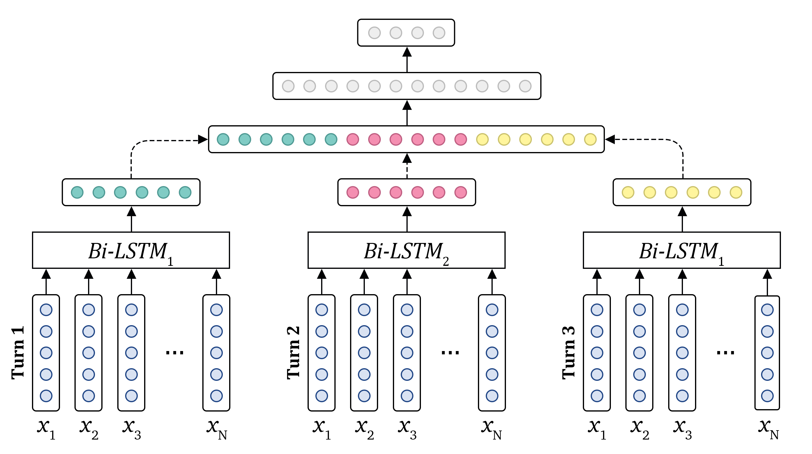

# EmoSense at SemEval-2019 Task 3: Bidirectional LSTM Network for Contextual Emotion Detection in Textual Conversations

## Overview
This repository contains the source code of the models used for _EmoSense_ submissions
for [SemEval-2019 Task 3 “EmoContext: Contextual Emotion Detection in Text”](https://www.humanizing-ai.com/emocontext.html).
The model is described in the paper 
["EmoSense at SemEval-2019 Task 3: Bidirectional LSTM Network for Contextual Emotion Detection in Textual Conversations"](https://www.aclweb.org/anthology/papers/S/S19/S19-2034/).

The proposed approach achieved 72.59% micro-average F1 score for emotion classes at the test dataset, thereby significantly outperform the officially-released baseline, namely larger in 14%.

We designed a specific architecture of LSTM which allows not only to learn semantic and sentiment feature represen- tation, but also to capture user-specific conversation features. In this work, we didn’t use any tradi- tional NLP features such as sentiment lexicons or hand-crafted linguistic by substituting them with word embeddings which were calculated automatically from the text corpora with an advanced pre-processing stage.

Citation:
```
@inproceedings{smetanin-2019-emosense,
    title = "{E}mo{S}ense at {S}em{E}val-2019 Task 3: Bidirectional {LSTM} Network for Contextual Emotion Detection in Textual Conversations",
    author = "Smetanin, Sergey",
    booktitle = "Proceedings of the 13th International Workshop on Semantic Evaluation",
    year = "2019",
    address = "Minneapolis, Minnesota, USA",
    publisher = "Association for Computational Linguistics",
    url = "https://www.aclweb.org/anthology/S19-2034",
    pages = "210--214",
}
```

*The architecture of a smaller version of the proposed model. LSTM unit for the first turn and for the third turn have shared weights.*

## Source Code of the Model
* The source code of the model is provided in
[EmoSense at SemEval2019 Task 3 EmoContext.ipynb](https://github.com/sismetanin/emosense-semeval2019-task3-emocontext/blob/master/EmoSense%20at%20SemEval2019%20Task%203%20EmoContext.ipynb).
* The models were trained using Keras 2.2.2 with TensorFlow 1.7.1 backend.

## Pre-trained Word Embeddings
The emotion detection models were trained on top of pre-trained [DataStories](https://github.com/cbaziotis/datastories-semeval2017-task4) word embeddings, which were additionally fine-tuned on the automatically collected emotional dataset.

Texts were pre-processed by [Ekphrasis](https://github.com/cbaziotis/ekphrasis). This tool helps to perform spell correction, word normalization and segmentation and allows to specify which tokens should be omitted, normalized or annotated with special tags. 

**Pre-trained 300 dimensional embeddings may be downloaded at the following link: [emosense.300d.txt](https://yadi.sk/d/w-9Qzaa68gmeNA)**. Place the embeddings file in root directory for the program to find it.

## Documentation and How to report bugs
* Keras documentation: [https://keras.io/documentation/](https://keras.io/documentation/).
* Ekphrasis documentation: [https://github.com/cbaziotis/ekphrasis](https://github.com/cbaziotis/ekphrasis).
* Scikit-learn documentation: [http://scikit-learn.org/stable/documentation.html](http://scikit-learn.org/stable/documentation.html). 
* If you find any issues, please open a bug here on GitHub.